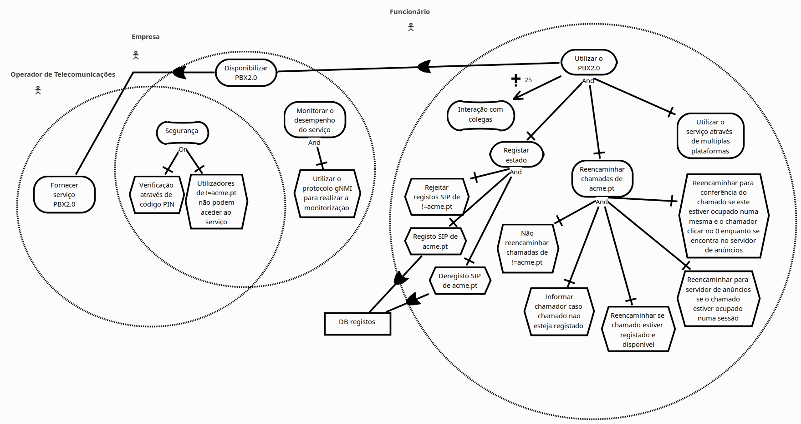

# IGRS24G10
A representação dos diferentes atores, objectivos, tarefas e recursos e relações entre estes elementos resultou no seguinte **GRL**:

A partir deste foi elaborado o seguinte **Product Backlog**:

>1. Epic: Fornecer serviço PBX2.0
>       - **Como:** Operador de Telecomunicações
>       - **Quero:** Fornecer serviço PBX2.0
>       - **Para:** Obter novas fontes de rendimento / Fins lucrativos

>2. User Story: Segurança
>       - **Como:** Operador de Telecomunicações e Empresa
>       - **Quero:** Garantir a segurança do serviço
>       - **Para:** Evitar danos de reputação e garantir a confidencialidade da informação da empresa

>3. Epic: Disponibilizar PBX2.0
>       - **Como:** Empresa
>       - **Quero:** Disponibilizar PBX2.0
>       - **Para:** Aumentar a eficiência dos funcionários

>4. User Story: Monitorizar o desempenho do serviço
>       - **Como:** Empresa
>       - **Quero:** Monitorizar o desempenho do serviço PBX2.0
>       - **Para:** Saber o impacto que o serviço está a ter

>5. Epic: Utilizar PBX2.0
>       - **Como:** Funcionário
>       - **Quero:** Utilizar PBX2.0
>       - **Para:** Interação com os colegas

>6. User Story: Interação com colegas
>       - **Como:** Funcionário
>       - **Quero:** Interação com colegas
>       - **Para:** Melhorar a eficiência do trabalho

>7. User Story: Registar estado
>       - **Como:** Funcionário
>       - **Quero:** Registar alteração de estado
>       - **Para:** Utilizar o PBX2.0

>8. User Story: Reencaminhar chamadas de acme.pt
>       - **Como:** Funcionário
>       - **Quero:** Reencaminhar chamadas de `acme.pt`
>       - **Para:** Utilizar o PBX2.0

>9. User Story: Utilizar o serviço através de múltiplas plataformas
>       - **Como:** Funcionário
>       - **Quero:** Utilizar o serviço através de múltiplas plataformas
>       - **Para:** Utilizar o PBX2.0